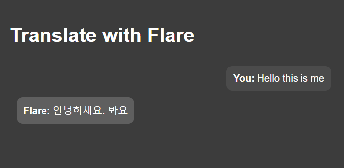

# Flare

<p align="center">

 

 <br>

 <br>

</p>


**Flare** is a translation chat tool designed to facilitate easy and interactive translation between multiple languages. With an intuitive chat interface, users can select from various language pairs and receive real-time translations, making it a useful tool for language learning and exploration.


## Why Flare is Important


In our increasingly globalized world, effective communication across different languages is crucial. **Flare** provides a simple yet powerful way for users to translate text between multiple languages, enhancing their ability to understand and interact with diverse content. It serves as an educational resource to better understand translation technology and its applications.


## Features


- **Real-Time Translation**: Translate text instantly between selected languages.

- **Interactive Chat Interface**: Communicate with the tool in a conversational manner.

- **Multiple Language Pairs**: Supports various language pairs including:

  - **Spanish-English**

  - **English-Korean**

  - **Korean-English**

  - **French-English**


## Technologies Used


- **IBM Watsonx.ai**: Utilizes the IBM Watsonx.ai multi-language model, specifically the `granite-20b-multilingual`, for generating translations. This model is known for its robust translation capabilities across a wide range of languages.

- **Flask**: A lightweight web framework for Python used to build the application's backend.

- **Python**: The primary programming language for developing the backend logic.

- **HTML & CSS**: Used for designing the frontend interface of the application.


## Utilization of Granite-20b-Multilingual


**Flare** leverages the power of the `granite-20b-multilingual` model from IBM Watsonx.ai to deliver accurate translations across multiple languages. This advanced model has been trained on a vast dataset to understand and precisely translate text, ensuring that users receive meaningful and contextually appropriate translations. The model supports a wide range of languages and is designed to handle various language pairs effectively.


## Accuracy and Limitations


While the `granite-20b-multilingual` model offers impressive translation accuracy, it's important to note that no model is perfect. Occasionally, translations may be inaccurate or contextually incorrect. **Flare** is designed for learning and exploration purposes, and users should be aware that results may vary.


## Disclaimer


**Flare** is intended for learning purposes and is not suited for professional use. The tool is designed to provide insights into translation technology and to aid in educational projects. For professional translation needs, please consult specialized services. Additionally, the model used may occasionally provide incorrect translations.


## Installation


1. Clone the repository:

   ```bash
   git clone https://github.com/yourusername/flare.git
   ```


2. Navigate to the project directory:

   ```bash
   cd flare
   ```


3. Install the required dependencies:


   ```bash

   pip install -r requirements.txt

   ```


4. Run the Flask application:

   ```bash
   python app.py
   ```


5. Open your web browser and go to `http://localhost:5000` to start using **Flare**.


## Usage


- Select a language pair from the sidebar.

- Type your message in the input box and click "Send" to receive a translation.

- The chatbox will display both user messages and translated responses.


For further details, refer to the project's documentation or contact the developer at [farheenimam331@gmail.com](mailto:farheenimam331@gmail.com).
